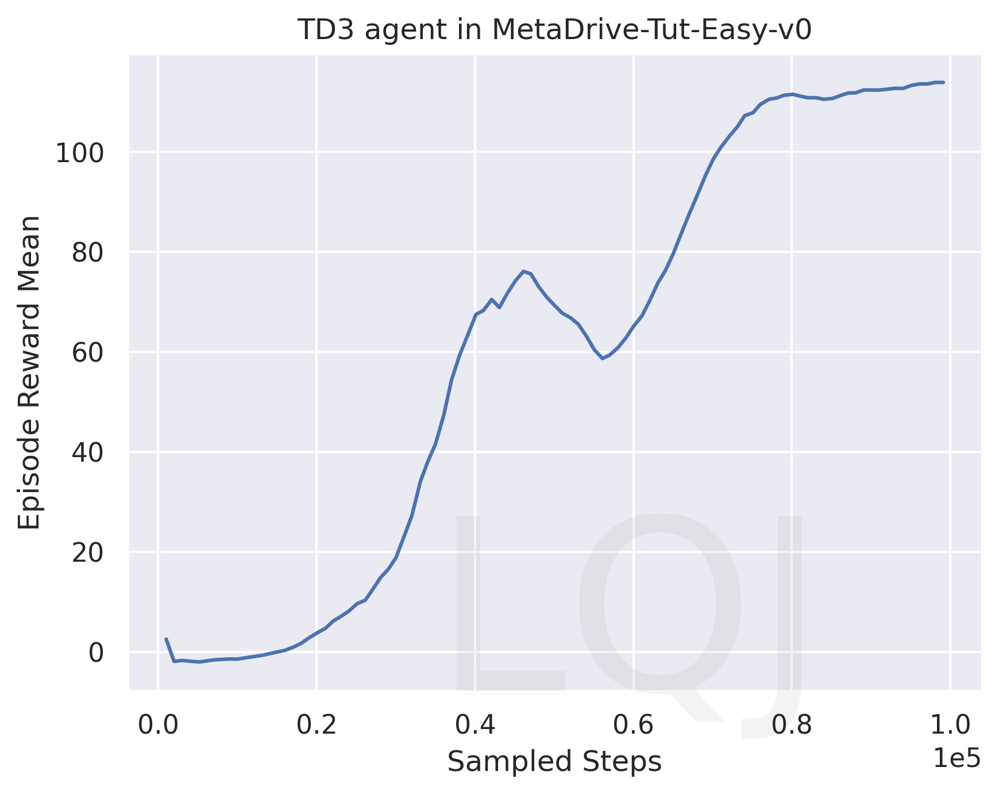
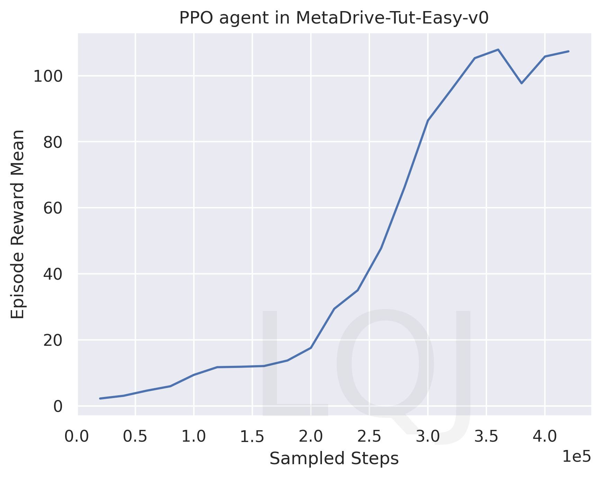

# Assignment 3 of CS269 2022 Fall

**NAME:** Linqiao Jiang

**UID:** 905542286

## Learning curves of TD3

(20 points are given to the code.)

### TD3 in Pendulum

(5 points)

[TODO]

### TD3 in MetaDrive-Tut-Easy-v0

(5 points)

[TODO]

## Learning curves of PPO

(15 points are given to the code.)

### PPO in CartPole

(2 points)

[TODO: Replace to your figure]

### PPO in MetaDrive-Tut-Easy-v0

(3 points)

[TODO: Replace to your figure]

## Learning curves of GAIL

(15 points are given to the code.)

### GAIL in MetaDrive-Tut-Easy-v0

(5 points)

[TODO]

## Generalization Experiment

In this section, you need to draw one figure
whose X-coordinate represents "the number of training scenes" and 
Y-coordinate represents "the episodic reward".

We expect two lines in the figure, showing the final training performance and 
the test performance varying with the number of training scenes. 

You can refer to the Figure 8 of the paper of  [MetaDrive paper](https://arxiv.org/pdf/2109.12674.pdf) 
to see the expected curves. [ProcGen paper](http://proceedings.mlr.press/v97/cobbe19a/cobbe19a.pdf) is also highly relevant.

Choosing one algorithm, you should train agents in `MetaDrive-Tut-[1,5,10,20,50,100]Env-v0` environments and test all agents in `MetaDrive-Tut-Test-v0`.

Please discuss the figure you get.

### The generalization curves

(20 points are given to the figure.)

[TODO]

[TODO]: Discuss the figure. Does it look normal? If not, why? Do you have any solution?

The graph we got is **not normal**. Since I decrease *num-envs* from 10 to 5, the two lines in the graph do not converge.

My solution will be tring increase *num-envs* value and *num-epoch* value.

## Discussion

In this section, you are free to write down your ideas and discussion. 
You can also leave this section blank.
If you conduct extra experiments, please record them here.

[Bonus]
GAIL_generalization

